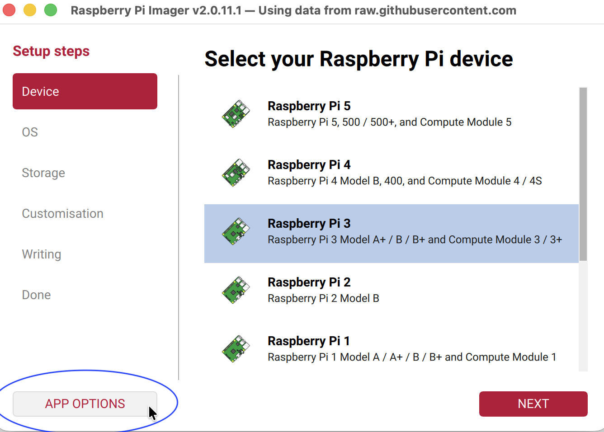
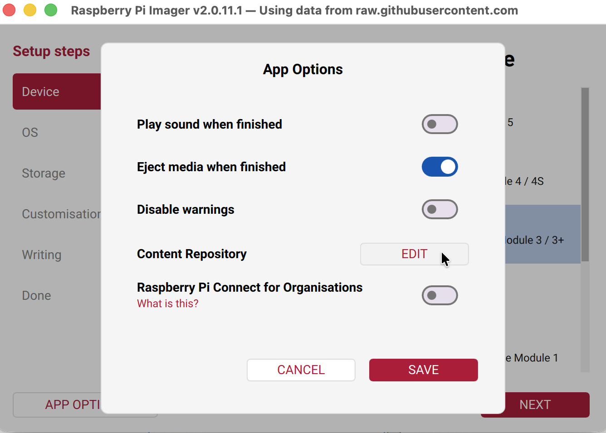
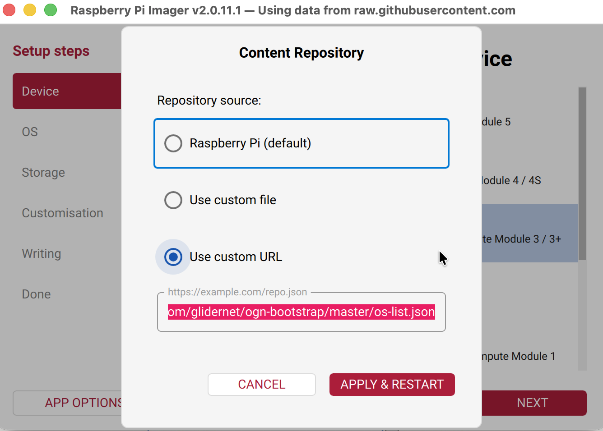
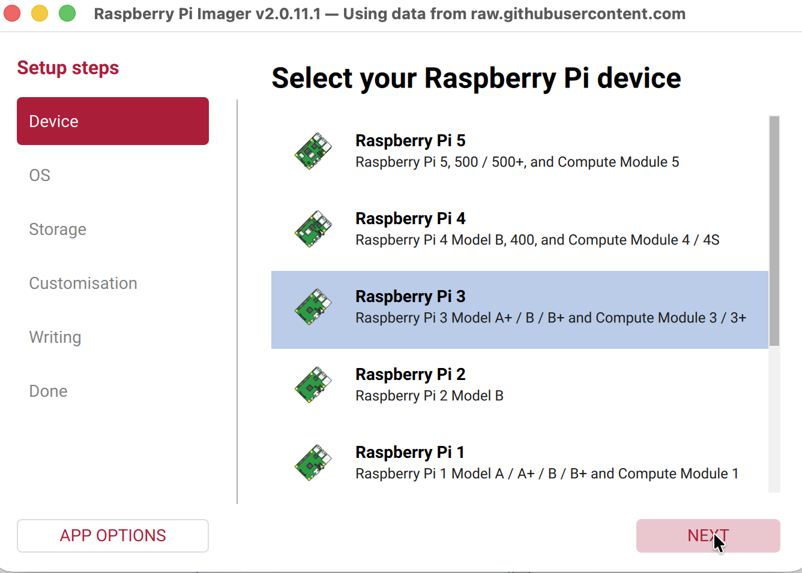
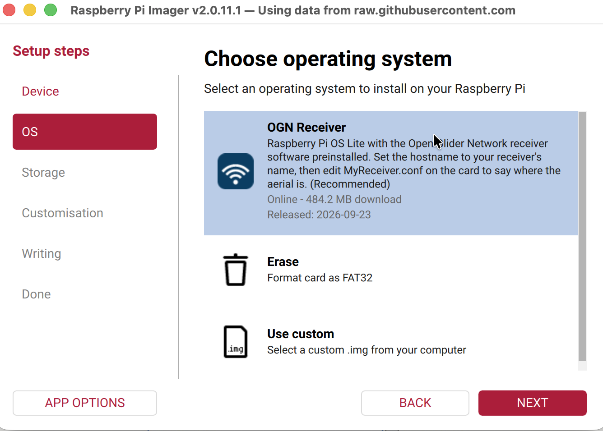

# ogn-bootstrap

ogn-bootstrap turns a Raspberry Pi into a receiver for the
[Open Glider Network](https://www.glidernet.org) (OGN). It picks up
aircraft broadcasting FLARM, ADS-B, ADS-L, FANET and other tracking signals
around your airfield and shares them on
[live.glidernet.org](https://live.glidernet.org).

If you add a second SDR stick, it also simplifies sending ADS-B to tracking
services such as ADS-B Exchange, adsb.fi, adsb.lol and airplanes.live. Each
one is a single setting, and you can turn on as many as you like (see
[ADS-B](#ads-b)).

You choose **OGN Receiver** in Raspberry Pi Imager, type in where your aerial
is, and put the card in the Pi. All the setup happens in Imager and in one
text file, so when the Pi boots for the first time it already has everything
it needs.

That also means you can set up a receiver for a hard-to-reach place, like a
locked box at the far end of an airfield, without having to visit it with a
keyboard and screen.

If you get stuck at any point, the OGN forum is a friendly place to ask.

## What you'll need

| | |
|---|---|
| A Raspberry Pi | A 3B, 3B+, 4, 5, CM3, CM4 or CM5. It needs to be 64-bit with at least 1 GB of RAM. The Zero 2 W and 3A+ won't work because they only have 512 MB, and the Pi 1, 2, Zero, Zero W and CM1 are 32-bit, so they won't work either. |
| An SD card | **8 GB or larger.** The image takes up 3.6 GB, so a 4 GB card will technically fit, but it doesn't leave room for updates. Anything over 16 GB is fine, but the extra space won't be used. |
| An RTL-SDR stick | An RTL-SDR Blog V3 or V4, or something similar. Sticks with a TCXO (temperature-compensated oscillator) are accurate out of the box and don't need calibrating. |
| An 868 MHz aerial | Mounted outdoors, and as high up as you can manage. |
| [Raspberry Pi Imager](https://www.raspberrypi.com/software/) **2.0 or newer** | Older versions can't set up the current Raspberry Pi OS (Trixie), and they won't tell you something has gone wrong. |

## Getting started

There are four steps. The first one you only need to do once.

### 1. Point Imager at this project

Raspberry Pi Imager normally shows Raspberry Pi's own list of operating
systems. To add the OGN receiver image, open **APP OPTIONS** at the bottom left
of the Imager window:



Click **EDIT** next to **Content Repository**:



Choose **Use custom URL** and paste in this address:

```
https://raw.githubusercontent.com/glidernet/ogn-bootstrap/master/os-list.json
```



Click **APPLY & RESTART**. When Imager opens again, the title bar should say
*Using data from raw.githubusercontent.com*. That means it worked.

If you prefer the command line, you can start Imager like this instead:

```sh
rpi-imager --repo https://raw.githubusercontent.com/glidernet/ogn-bootstrap/master/os-list.json
```

To go back to Raspberry Pi's usual list later, open the same dialog and choose
**Raspberry Pi (default)**.

### 2. Write the card

Under **Device**, choose your model of Pi and click **NEXT**:



Under **OS** you'll see a single entry, **OGN Receiver**:



Choose it, then choose your SD card under **Storage**. Imager will then walk you
through some customisation settings. Fill in:

- **Hostname.** This is also used as your receiver's name on the OGN network,
  so pick something like `Lasham` or `EGHL`. It can be up to 9 letters and
  digits.
- **Username and password** for logging in to the Pi.
- **Wi-Fi details**, if the Pi won't be plugged in to a network cable.
- **SSH**, with your public key, if you'd like to be able to log in remotely.

These settings work exactly the same as they do for the standard Raspberry Pi
OS, because underneath, this *is* the standard Raspberry Pi OS with a few
additions. There's more about that in [How the image is built](#how-the-image-is-built).

### 3. Tell it where your aerial is

When Imager finishes, it ejects the card. Take the card out and put it back in
again, and a drive called `bootfs` will appear. On it you'll find a file called
`MyReceiver.conf`.

Open it in any text editor (Notepad or TextEdit is fine). There are four lines
marked `TODO` that you need to fill in:

```c
Call       = "";          # leave blank to use the hostname you set in Imager
Latitude   =    +0.0000;  # where the AERIAL is, in decimal degrees
Longitude  =    +0.0000;
Altitude   =          0;  # metres above sea level, at the aerial
```

The file explains each setting in detail. The three things people most often
get wrong are:

- Latitude and longitude need to be in **decimal degrees** (like `51.1872`),
  not degrees and minutes.
- Altitude is in **metres**, not feet.
- It's the height of the **aerial** itself, not the bottom of the mast.

Everything else in the file starts with a sensible default, and the comments
explain what each setting does if you'd like to change it.

Save the file and eject the card.

### 4. Start it up

Put the card in the Pi, connect the SDR stick and aerial, and switch on.

The first start-up usually takes a minute or two. The Pi downloads the OGN
decoder software (about 350 kB) and some altitude data, then restarts itself
once to finish setting up. It can take a little longer if:

- you turned on [calibration](#calibrating-the-sdr), which adds up to three
  minutes, or
- you set up Raspberry Pi Connect in Imager. In that case the Pi waits until
  Connect has signed in before it restarts (see
  [Connect and the read-only root](#connect-and-the-read-only-root)).

### Checking it's working

Once it's up and running, you can check on it from another computer on the
same network. Replace `<hostname>` with the name you chose in Imager:

```
http://<hostname>.local:8080/        radio status page
http://<hostname>.local:8081/        decoder status page
ssh <user>@<hostname>.local          then run: systemctl status rtlsdr-ogn
```

Within a few minutes, your receiver should appear on
[live.glidernet.org](https://live.glidernet.org).

**If the Pi couldn't get online the first time**, it keeps trying. It waits up to
five minutes for a network connection. If it still can't download what it
needs, it tries again every 15 minutes and every time it starts up, until it
succeeds. Once you've plugged in a network cable or corrected the Wi-Fi details, it
will carry on by itself.

If you'd like to see what it's doing, these will help:

- `systemctl status ogn-install-retry.timer` shows whether it's waiting to retry.
- `/var/log/cloud-init-output.log` and `journalctl -u ogn-install-retry` show
  why it hasn't worked yet.

## What gets set up

| | |
|---|---|
| OGN decoder | Downloaded from glidernet and checked against the checksums in [`versions.json`](versions.json) |
| DVB-T blacklist | Stops the Pi's TV drivers from taking over the SDR stick |
| `rtlsdr-ogn.service` | Runs the decoder, and only starts it once the Pi's clock is set correctly |
| Read-only filesystem | Protects the SD card from wearing out or being corrupted (see [Protecting the SD card](#protecting-the-sd-card)) |
| Hardware watchdog | Restarts the Pi automatically if it freezes |
| Weekly maintenance | Installs security updates and new OGN versions at a time you choose |
| Settings sync | Reads `MyReceiver.conf` from the card every time the Pi starts, so you can change settings without logging in |
| WireGuard | Optional, off unless you turn it on. Lets you reach the receiver from anywhere through your own VPN. |
| ADS-B | Optional, off unless you turn it on. Uses a second SDR stick to pick up aircraft on 1090 MHz. |
| Geoid data | Corrects the altitudes the receiver reports for the shape of the Earth |

Nothing is opened up to the internet, and remote access is switched off,
unless you choose to turn it on.

## Changing settings later

The Pi reads `MyReceiver.conf` from the SD card **every** time it starts, not
just the first time. So to change a setting, you can do exactly what you did at
the start: put the card in your computer, edit the file on `bootfs`, and put
the card back in the Pi.

The new settings are picked up early in start-up, before the decoder starts, so
they take effect without any further restarts. If the file hasn't changed,
nothing happens.

If you make a mistake in the file, like a receiver name that isn't allowed or a
position still set to 0,0, the Pi won't use the new file. It carries on with
the settings it already had and records the reason in its log. A typo won't
take a working receiver off the air.

### Editing settings on the Pi itself

If you can log in to the Pi, the file is at `/boot/firmware/MyReceiver.conf`.
That part of the card is normally locked against changes, to protect it, so
you'll need to unlock it before editing and lock it again afterwards:

```sh
sudo mount -o remount,rw /boot/firmware
sudo nano /boot/firmware/MyReceiver.conf
sudo sync
sudo mount -o remount,ro /boot/firmware
sudo ogn-maintenance --config-sync     # apply the changes now instead of at the next restart
```

Make sure you've closed the editor before running the last `mount` command. If
the file is still open, you'll see a "busy" error and the card will stay
unlocked until the Pi restarts. That won't break anything, but the card isn't
protected against power cuts in the meantime.

`--config-sync` applies everything except the `Install` section. Changes to
WireGuard and ADS-B take effect straight away if they're already running, or
at the next restart if not.

The **`Install`** section works a little differently, because it controls how
the Pi itself is set up: which software is installed, whether the filesystem
is read-only, and when maintenance happens. Changing it re-runs the installer
after the Pi has connected to the network. The installer won't restart the Pi
by itself at this point, so if you change `ReadOnlyFS`, restart the Pi
yourself afterwards.

### Changing the Wi-Fi on a receiver you can't reach

This one is worth knowing about before you need it. The Wi-Fi details you give
Imager are only read once, the very first time the Pi starts. After that
they're stored on a part of the card that Windows and macOS can't open. So if
your club changes its Wi-Fi password, a receiver that's only connected by
Wi-Fi would have no way to get back online.

To fix that, you can put new Wi-Fi details in `MyReceiver.conf`, which you can
edit from any computer:

```c
Network:
{
  Wifi:
  {
    SSID     = "Clubhouse";
    Password = "the new one";
    Country  = "";          # only needed if the receiver has moved to another country
    Hidden   = false;
  } ;
} ;
```

If you leave `SSID` empty (which is how it starts), this section is ignored
and the Wi-Fi you set up in Imager carries on as before. If you fill it in,
these details take priority over the Imager ones, and the old connection is
left in place as well.

The password is stored as plain text on the card, so anyone who has the card
can read it. Imager also stores the original Wi-Fi password the same way, so
this doesn't add any new risk, but it's worth bearing in mind before you lend
the card to anyone. On the Pi itself, only the administrator account can read
it (see [Credentials on the card](#credentials-on-the-card)).

### Calibrating the SDR

Most receivers don't need this. The SDR sticks recommended above are accurate
straight out of the box. Cheaper sticks (often plain black or blue ones with an
R820T chip) can be quite far out, and drift as they warm up, so it's worth
calibrating those.

Calibration is off by default. To turn it on, find this line in the `RF`
section:

```c
Calibrate  = false;      # set to true, restart, and the result is written here
```

Change it to `true`, put the card back in the Pi and switch on. The Pi measures
how far out the stick is by listening to nearby mobile phone (GSM) masts. It
then writes the result into the `FreqCorr` line **in the same file on the
card**, and sets `Calibrate` back to `false` so it only happens once.

The result goes on the card so you can read it from your computer, the same
way you edited the file.

A few things to know:

- The aerial needs to be connected, and there needs to be mobile phone coverage
  where the receiver is.
- The receiver stops for up to three minutes while it measures, and then starts
  again by itself.
- If you have an amplifier or a filter on your aerial, it will probably block
  the signals calibration needs, and it won't find anything. That's expected
  and doesn't mean anything is wrong. Calibration still switches itself off,
  and leaves a note explaining what happened:

  ```c
  Calibrate  = false;   # 2026-09-23: no usable GSM signal found; FreqCorr left unset
  ```

If you're logged in to the Pi, `sudo ogn-calibrate` measures the stick and
shows you the result without changing anything. `sudo ogn-calibrate --apply`
measures it and applies the result to the running receiver.

## Updates

Your receiver keeps itself up to date. Once a week it installs security updates
and any new version of the OGN software.

By default this happens on **Monday at 3am**, plus a random delay of up to half
an hour. We chose Monday rather than the weekend so that if an update ever
causes a problem, you'll find out at the start of the week rather than on a
flying day. You can change the time with the `MaintenanceWindow` setting, or
set `MaintenanceWindow = ""` to turn automatic updates off.

Because the filesystem is read-only, updating takes two restarts. The Pi
switches read-only mode off, restarts, installs the updates, switches read-only
mode back on and restarts again. It keeps track of where it's got to on the
card, so if the power goes off part-way through, it carries on (or safely backs
out) next time it starts.

If you're logged in, these commands are useful:

```sh
sudo ogn-maintenance --status       # see where things are up to
sudo ogn-maintenance --now          # run the update cycle now
sudo ogn-maintenance --config-sync  # re-read MyReceiver.conf from the card
sudo ogn-update --check             # compare the installed and available OGN versions
```

Your receiver follows the update channel set in `Install.UpdateChannel`. This
can be `stable` (the default), `latest`, or a specific version number.

### Making other changes by hand

The weekly updates take care of security fixes and new OGN versions. If you
want to do anything else, like installing extra software or changing something
in `/etc`, you'll need to switch read-only mode off first. Otherwise your
changes will quietly disappear the next time the Pi restarts.

The `overlay` command switches it on and off:

```sh
overlay status                # shows whether read-only mode is on now, and after a restart (no sudo needed)
sudo overlay off --reboot     # restarts with read-only mode off
  ... make your changes ...
sudo overlay on --reboot      # restarts with read-only mode back on
```

The change always takes effect when the Pi restarts. If you leave out
`--reboot`, it sets things up and reminds you to restart when you're ready.

Every time you log in, a message shows which mode the Pi is in:

```
  Filesystem:  READ-ONLY. Anything you change is discarded at the next reboot.
               To make a change stick:  sudo overlay off --reboot
```

When read-only mode is off, the message is more noticeable, as a reminder to
switch it back on. A receiver left in writable mode is much more likely to
end up with a corrupted card after a power cut.

## Remote access

There are several ways to reach your receiver when you're not on the same
network. They're all **off by default**. The first three are in the
`Install.RemoteAdmin` section of `MyReceiver.conf`:

| Setting | What it does |
|---|---|
| `Connect` | Turns on [Raspberry Pi Connect](https://www.raspberrypi.com/documentation/services/connect.html), which gives you a terminal in your web browser using your Raspberry Pi ID. It works even when the Pi is behind a router. If you set `ConnectAuthKey` to an organisation key, it signs in automatically. Otherwise you'll need to sign in once yourself (see [Connect and the read-only root](#connect-and-the-read-only-root)). |
| `OGNTeam` | Lets the OGN core team log in to help you diagnose problems. They'll need to accept your receiver's key first, so ask on the OGN forum. Bear in mind that **this gives people outside your club access to a machine on your club's network.** It can be very helpful for a receiver that nobody nearby can look after, but it's your decision. |
| `ExtraSSHKeys` | Adds more SSH keys that can log in. If you add any, logging in with a password over SSH is switched off. |

The fourth option is a [WireGuard tunnel of your own](#a-wireguard-tunnel-of-your-own),
which is in the `Network.WireGuard` section.

### Connect and the read-only root

**If you set up Raspberry Pi Connect in Imager, this is handled for you.** The
Pi waits until Connect has signed in before switching to read-only mode, so the
sign-in is kept. The receiver works normally while it waits, and the login
message tells you what it's waiting for. The Imager key expires after six
hours, though, so if the Pi doesn't get online within that time, you'll need
to sign in by hand as described below.

If you're signing in by hand, there's one thing to watch out for. Connect saves
its sign-in on the part of the card that's read-only, so if you sign in while
read-only mode is on, it works until the next restart and then quietly signs
out again. To avoid that, switch read-only mode off while you sign in:

```sh
sudo overlay off --reboot
rpi-connect signin            # then open the link it shows you
sudo overlay on --reboot
rpi-connect status            # after the restart, this should say: Signed in: yes
```

### A WireGuard tunnel of your own

Raspberry Pi Connect and OGN team access both go through someone else's
servers. If you'd rather keep everything under your own control, and you
already run a WireGuard VPN server, the receiver can connect out to it. You
can then reach it at a fixed address on your VPN from anywhere, without having
to set up port forwarding at the airfield.

First, add the receiver to your WireGuard server. You'll need a key pair for
it, which you can create on any computer with `wireguard-tools` installed:

```sh
wg genkey | tee receiver.key | wg pubkey > receiver.pub
```

Add `receiver.pub` and the receiver's address as a `[Peer]` on your server.
Then put the private key (`receiver.key`) in `MyReceiver.conf` on the card:

```c
Network:
{
  WireGuard:
  {
    Enable     = true;
    PrivateKey = "<contents of receiver.key>";
    Address    = "10.6.0.7/32";
    MTU        = 0;

    Peer:
    {
      PublicKey           = "<your SERVER's public key>";
      Endpoint            = "vpn.example.org:51820";
      AllowedIPs          = "10.6.0.0/24";
      PresharedKey        = "";
      PersistentKeepalive = 25;
    } ;
  } ;
} ;
```

Once the Pi restarts, you can SSH to `10.6.0.7` from anywhere on your VPN.

A few notes on the settings:

- **`AllowedIPs`** is the list of addresses on *your server's* side that the
  receiver should send through the tunnel. Usually that's just your VPN subnet.
  If you need to reach other networks behind the server, list them in the same
  string separated by commas, like `"10.6.0.0/24, 192.168.50.0/24"`. We don't
  recommend `0.0.0.0/0`: it would send *all* the receiver's traffic, including
  its OGN data, through your server, so if your server went down the receiver
  would stop reporting too. It also needs `nftables` or `iptables` on the Pi.
- **`PersistentKeepalive = 25`** keeps the connection open through the
  airfield's router so that you can connect in to the receiver. 25 seconds is
  the usual value.

Some useful things to know once it's running:

| | |
|---|---|
| Checking it | `sudo ogn-wireguard status` shows whether the tunnel is up and whether it has ever successfully connected to your server |
| If your server's address changes | If the connection drops, the receiver looks up your server's address again every 10 minutes, so dynamic DNS works fine |
| Turning it off | Set `Enable = false` on the card. It stops at the next restart, or straight away if you run `sudo ogn-maintenance --config-sync` |
| Software | Everything WireGuard needs is already on the card, so turning it on only needs an edit to `MyReceiver.conf` |

The private key is stored as plain text on the card, and anyone who has the
card can read it. There's no way around that for a device that sets itself up
without anyone logging in. We suggest giving each receiver its own key, so that
if a card is ever lost, you only need to remove that one receiver from your
server.

### Credentials on the card

It's worth knowing which passwords and keys end up on the SD card. From
`MyReceiver.conf`, these are:

- the Wi-Fi password
- a Raspberry Pi Connect key, if you've set one
- the WireGuard private key and preshared key, if you've set them

Imager also saves the Wi-Fi password (in `network-config`) and a hash of your
login password (in `user-data`) on the same part of the card.

That part of the card can be read on any computer, so **anyone who has
physical access to the card can read these.** We'd suggest:

- giving each receiver its own keys, so losing one card only affects one receiver
- if you can, using a separate Wi-Fi network just for the receiver, with a
  password you wouldn't mind someone finding

On the Pi itself, we've done what we can to keep them private:

| | |
|---|---|
| On the Pi | Only the administrator (root) account can read the card's boot partition. This takes effect from the next restart. |
| The decoder's copy | The decoder gets its own copy of `MyReceiver.conf`, with all the passwords and keys removed. It doesn't need any of them. |
| Over the network | The status pages on ports 8080 and 8081 only show specific pages. They show the config file's name, but not what's in it. |
| In the logs | The WireGuard tunnel logs its address and server, but never a key. |

Because only root can read the boot partition, `overlay status` and
`ogn-maintenance --status` read a copy of the relevant details that's saved
somewhere readable every time the Pi starts. If that copy is missing for some
reason, they'll say `unknown` instead of guessing.

## ADS-B

This is optional, and separate from the receiver's main OGN reception.

With a second SDR stick tuned to 1090 MHz, your receiver can also pick up
ADS-B. That includes airliners and any other aircraft with a transponder that
don't show up on FLARM. The image includes
[`readsb`](https://github.com/wiedehopf/readsb), which decodes ADS-B and passes
it to the OGN decoder, so those aircraft appear on the OGN network alongside
the gliders. If you'd like to, you can also share it with flight tracking
websites.

It works without any accounts or keys, and nothing is downloaded from
tracking websites.

### Setting it up

You'll need a second SDR stick and a 1090 MHz aerial. The small aerial that
often comes with the stick will pick up aircraft directly overhead, but not
much else.

First, give each stick its own serial number. This makes sure the Pi always
knows which is which, even if they're unplugged and plugged back in:

```sh
rtl_test                  # lists the sticks that are plugged in, with their index and serial number
rtl_eeprom -d 0 -s 868    # the OGN stick
rtl_eeprom -d 1 -s 1090   # the ADS-B stick
```

Then, in `MyReceiver.conf` on the card, set `RF.DeviceSerial` to the OGN stick,
and uncomment the `ADSB` section:

```c
RF:
{
  DeviceSerial = "868";
} ;

ADSB:
{
  Enable       = true;
  DeviceSerial = "1090";
  Gain         = -10;

  AVR    = "localhost:30002";
  MaxAlt = 18000;
} ;
```

Restart the Pi, then run `sudo ogn-adsb status` to see whether it's picking up
any aircraft.

You do need to set **both** serial numbers. ADS-B won't start without them.
Without serial numbers, the Pi numbers the sticks in the order they're
detected, and that order can change. If it does, the OGN decoder can end up
using the ADS-B stick, which looks just like a problem with the aerial and can
be very confusing to track down.

### Sharing with tracking websites

By default, ADS-B data stays on your Pi and is only sent to OGN. If you'd like
to share it with other websites as well, switch them on here:

```c
  Feed:
  {
    ADSBExchange  = false;
    ADSBFi        = false;
    ADSBLol       = false;
    AirplanesLive = false;

    MLAT          = false;

    Custom        = "";
  } ;
```

Each site you switch on will receive every aircraft your receiver picks up, for
as long as it's switched on. None of them need an account or a sharing key,
and none of them can connect back in to your receiver. You can choose each
site separately.

- **`MLAT`** (multilateration) lets the sites work out the position of
  aircraft that don't broadcast their own, by comparing when the same signal
  reached several receivers. It sends your receiver's timing data to the sites
  you've switched on. For this to be useful, your `Position` needs to be
  accurate to within a few metres, because a wrong position makes the results
  worse for everyone. It won't start if your position is still set to `0,0`.
- **`Custom`** lets you send data to any other service that accepts the Beast
  format. Use `"host:port, host:port"`.

Each site is sent an ID, so it can tell your receiver's data apart from
everyone else's and show you your receiver's statistics. The ID is worked out
from the Pi's serial number, so it stays the same even if you rewrite the card,
and the site keeps your history. Only a scrambled (hashed) version of the
serial number leaves the Pi. If a site already knows your receiver by a
different ID, you can set `UUID` in the `Feed` section to use that one instead.

### FlightAware, Flightradar24 and Plane Finder

These three aren't in the list above, because each one needs its own software
from the company that runs it, rather than something from Debian. You can
still install them yourself, though. `readsb` is already providing data on
port 30005 (Beast format) and port 30002 (AVR format) for them to use.

The steps are the same for each one:

1. Get the `ADSB` section working first.
2. Switch read-only mode off.
3. Install the company's software, connect it to `readsb`, and sign up.
4. Switch read-only mode back on.

```sh
sudo ogn-adsb status          # check aircraft are being picked up before going any further
sudo overlay off --reboot     # restarts with read-only mode off
  ... install and sign up (see below) ...
sudo overlay on --reboot      # restarts with read-only mode back on
```

**Keep read-only mode off until you've finished signing up.** Each service
saves your sharing key or feeder ID in a file on the Pi. If that's created
while read-only mode is on, it's lost at the next restart, and the service
will sign you up as a brand new receiver every time the Pi starts. It's also a
good idea to write the key down somewhere: if you ever rewrite the card, giving
the service your old key keeps your receiver's history.

**When the installer offers to set up `dump1090`, say no.** It would compete
with `readsb` for the 1090 MHz stick. Each one just needs to know there's a
Beast receiver at `127.0.0.1` on port `30005`.

**FlightAware.** Install `piaware` using FlightAware's instructions for
Raspberry Pi OS. Use their package repository, not their PiAware SD card
image. Then run:

```sh
sudo piaware-config receiver-type other
sudo piaware-config receiver-host 127.0.0.1
sudo piaware-config receiver-port 30005
sudo piaware-config mlat-results false
sudo systemctl restart piaware
```

Then claim your feeder at flightaware.com/adsb/piaware/claim from a computer on
the same network. `piaware` needs to have run at least once before you switch
read-only mode back on, so that its feeder ID (in
`/var/cache/piaware/feeder_id`) is saved. The `mlat-results false` setting is
needed because FlightAware's terms don't allow their position results to be
passed on to other services, which would otherwise include OGN.

**Flightradar24.** Run the Raspberry Pi install command from the *Share your
data* page on Flightradar24's website. When it asks:

- **Receiver type:** choose ModeS Beast (TCP), at `127.0.0.1:30005`
- **Position:** use the same position as in `MyReceiver.conf`, but note that
  Flightradar24 wants the altitude in **feet**, not metres

`fr24feed-status` shows whether it's connected, and there's a status page on
port 8754. Your sharing key is saved in `/etc/fr24feed.ini`.

**Plane Finder.** Download the `pfclient` package for 64-bit ARM from Plane
Finder's website and install it. Then open `http://<hostname>.local:30053/` in
your browser and follow the setup steps. Choose data format **Beast**, TCP,
address `127.0.0.1`, port `30005`. Your share code is saved in
`/etc/pfclient-config.json`.

**Keeping them up to date.** The weekly maintenance only updates software from
Debian and Raspberry Pi, so it won't update these three. To update them, switch
read-only mode off, run `sudo apt update && sudo apt install --only-upgrade
piaware fr24feed pfclient` (including just the ones you have), and switch it
back on.

They all rely on the `ADSB` section being switched on, since they use its
stick. If you set `Enable = false`, they'll stop receiving any data.

Their logs are kept in memory while read-only mode is on, so they don't wear
out the card, but they're cleared every time the Pi restarts.

### What ADS-B doesn't include

There's no aircraft map. The popular one, `tar1090`, is installed by running a
script from GitHub rather than from a package, and we didn't want to build that
into every card. If you add it yourself, move it off port 8080 or change
`HTTP.Port` in the config, since the OGN status pages use 8080 and 8081. Bear in
mind that a map needs `readsb` to write data to the card every second, which is
exactly the kind of wear the read-only filesystem is there to prevent.

## How it works

This section explains what's going on behind the scenes: how the card is
protected, what's on it, and how downloads are checked.

### Protecting the SD card

SD cards can fail in two ways: they wear out from lots of small writes, and
they can get corrupted if the power is cut while something is being written.
A receiver on an airfield is likely to face both. So with `ReadOnlyFS = true`
(the default), the aim is for nothing to be written to the card at all during
normal running.

Here's how each part of that works:

| | |
|---|---|
| Main filesystem | Uses `overlayroot=tmpfs`, set in `cmdline.txt` on the boot partition. Any changes are kept in memory and cleared when the Pi restarts. You can switch it on and off with [`overlay`](#making-other-changes-by-hand). |
| System log | Kept in memory (`/run`), limited to 32 MB. This is set explicitly, so it stays in memory even if you switch `ReadOnlyFS` off. |
| rsyslog | Not installed on Trixie. If something else installs it, it's switched off, because it writes to the card constantly. |
| File access times | Raspberry Pi OS already turns these off (`noatime`). |
| Swap | Switched off. With everything already in memory, a swap file would just use up more memory. |
| ADS-B | `readsb` is set up so that it never writes to the card. |
| Boot partition | Mounted **read-only**, and readable only by root (see [Credentials on the card](#credentials-on-the-card)). It's unlocked just long enough to save the maintenance progress, which is only a handful of writes a week. |

The boot partition needs special care. Unlike the main filesystem, it can't be
hidden behind the in-memory layer, because the Pi reads its setup from there
and the maintenance progress needs to survive restarts. It also uses the FAT
format, which is the most likely to be corrupted by a power cut. So it stays
locked except for those few seconds.

The result: between maintenance windows, a receiver with `ReadOnlyFS = true`
doesn't write to the card at all, so it's safe to switch off at the wall
whenever you like.

The trade-off is that any changes you make by hand are lost at the next
restart. That's why `MyReceiver.conf` is read from the card every time the Pi
starts: the card is the one place changes are kept, so it always wins. For
anything else, see [Making other changes by hand](#making-other-changes-by-hand).

### How the image is built

The image isn't a new operating system. It's the official **Raspberry Pi OS
Lite (64-bit)**, downloaded from Raspberry Pi and checked against the same
SHA256 checksum Imager uses, with a small number of additions:

| | |
|---|---|
| Software installed | `rtl-sdr`, `librtlsdr0`, `libpng16-16t64`, `lynx`, `unattended-upgrades`, `overlayroot`, `autossh`, `wireguard-tools` and `mlat-client-adsbfi`, all from the Debian and Raspberry Pi package archives. Also `readsb`, built from the [original source](https://github.com/wiedehopf/readsb) at a fixed version, because Debian's version doesn't support RTL-SDR sticks. |
| Files added | A setting for `readsb.service` so it doesn't write to the card; the `ogn-*` scripts in `/usr/local` (plus `overlay`, a shortcut to `ogn-overlay`); `MyReceiver.conf` and the first-start installer on the boot partition; and `/etc/ogn-bootstrap-image`, which records what the image was built from |
| Files changed | None |
| Filesystem size | 512 MB larger, to make room for the above. As usual, the Pi expands it to fill the card when it first starts. |

cloud-init, which handles Imager's settings, is left exactly as Raspberry Pi
provides it. That's why the hostname, user, Wi-Fi, SSH and Raspberry Pi
Connect settings in Imager work just as they do with the standard image.

If you've used the older OGN image, you may remember it needed shrinking down
before it could be shared. That was because it was copied from a real SD card.
This one is built directly from Raspberry Pi's own image, which is already as
small as it can be, so there's nothing to shrink. The 512 MB we add (taking it
from 3.06 GB to 3.60 GB) gives the software updater room to work, and barely
changes the download size because the extra space compresses to almost
nothing.

**The OGN decoder software isn't included in the image.** `ogn-rf` and
`gsm_scan` are GPLv3, and `ogn-decode` doesn't come with permission to
redistribute it. So each receiver downloads them when it first starts, and
checks them against [`versions.json`](versions.json). There's more about this
in [CREDITS.md](CREDITS.md).

If you'd like to build the image yourself, or check that the published image
matches this code:

```sh
sudo tools/build-image.sh          # Linux only; needs loop devices and qemu
```

This needs to run as root on Linux, because it mounts a disk image and runs
`apt` inside an emulated 64-bit ARM system. It's really designed to run in CI.
[`.github/workflows/build-image.yml`](.github/workflows/build-image.yml) shows
exactly how it's run, and explains why building and publishing are kept as
separate steps.

### How downloads are checked

`download.glidernet.org`, where the OGN decoder comes from, doesn't support
HTTPS properly. So the checksums are kept in this project instead, in
[`versions.json`](versions.json), which receivers download securely from
GitHub. The receiver checks the SHA256 checksum of everything it downloads
before installing it. (The MD5 checksums published by glidernet are checked
too, but they only catch downloads that got damaged on the way.)

## Installing on a Pi that's already running

If you already have Raspberry Pi OS Trixie running and don't want to rewrite
the card, you can run the installer directly:

```sh
git clone https://github.com/glidernet/ogn-bootstrap
sudo cp ogn-bootstrap/boot/MyReceiver.conf /boot/firmware/   # then edit it
sudo ogn-bootstrap/src/ogn-install
```

Another option is to start from a standard Raspberry Pi OS Lite card (dated
2025-11-24 or later) and copy [`boot/vendor-data`](boot/vendor-data) and
[`boot/MyReceiver.conf`](boot/MyReceiver.conf) onto its boot partition. It ends
up exactly the same as using the OGN image, because it runs the same
installer. It takes longer on the first start, and needs a more reliable
network connection, because it has to download all the software rather than
having it already on the card.

## Older receivers

Before Trixie, OGN receivers were set up differently, using a web page you
opened in your browser after starting the Pi. That version is still available
at the [`v2.1-legacy`](https://github.com/glidernet/ogn-bootstrap/tree/v2.1-legacy)
tag, but it's no longer maintained.

## For contributors

```sh
tests/run-tests            # offline tests: parser, validation, manifest, build
tools/build-vendor-data    # rebuild boot/vendor-data after editing src/
tools/make-icon            # rebuild doc/ogn-icon.png
```

`boot/vendor-data` is generated from `src/`, so edit the files in `src/` and
then rebuild it. It's kept as readable shell script rather than packed into a
single encoded file, because it ends up on other people's SD cards and they
should be able to read what it does.

The tests cover the parts that don't depend on hardware. Installing packages,
systemd services and the read-only overlay can only really be tested on a Pi,
so flash a spare card and watch `journalctl -u cloud-final`.

### Adding a new OGN release

New OGN decoder versions are added by pull request:

```sh
tools/add-version 0.3.2 --promote latest     # download, calculate checksums, record
# then, once you've tested it on a receiver or two:
#   edit channels.stable and commit
```

Receivers on the `stable` channel won't get the new version until it's
promoted there.

## Licence

**This repository** is MIT licensed (see [LICENSE](LICENSE)). Everything in it
was written for this project. [CREDITS.md](CREDITS.md) explains what it was
based on.

**The published image** includes Raspberry Pi OS, so the rest of the software
on it keeps its own licences, mostly GPL. You can find the details for each
package in `/usr/share/doc/*/copyright` on the card. This is the same way
Raspberry Pi OS and other Debian-based systems are distributed.

The GPL means the source code needs to be available.
[CREDITS.md](CREDITS.md#the-published-image) explains how: it comes from
Debian's and Raspberry Pi's own archives, and `/etc/ogn-bootstrap-image` on
each card records exactly which base image (and its SHA256) was used, so you
can always find the matching versions.

**The receiver software** (`ogn-rf`, `gsm_scan` and `ogn-decode`) isn't part
of this project and isn't included in the image. Each receiver downloads it
when it's installed, because `ogn-decode` doesn't come with permission to
redistribute it.
